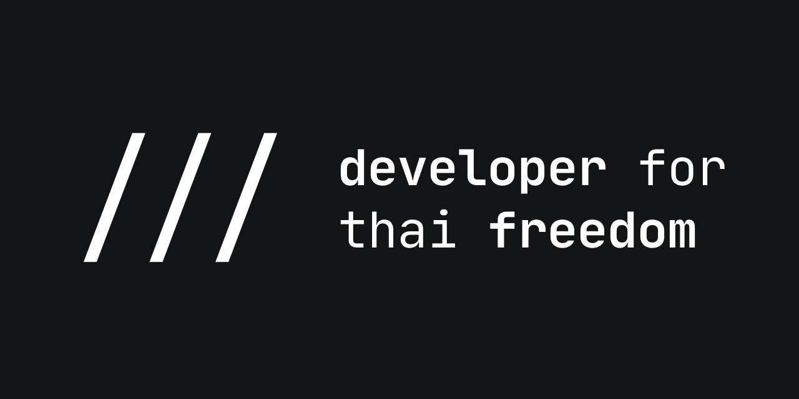

# Developer for Thai Freedom Hackathon #Devปลดแอก

 

Welcome to the main repository of the **Developer for Thai Freedom hackathon** project. This repository will contain the policy, design, proposals, documentation and information for the project.

Developer For Thai Freedom hackathon (or #devปลดแอก) is a hackathon for developers to actively participate in the fight for freedom and democracy in Thailand by building software and hardware solutions, in order to solve problems you faced in the democratic process (i.e. problems you faced when going to protests, or when signing petitions.)

Join us on **Discord** and hack away: [https://discord.com/invite/qayPpkG](https://discord.com/invite/qayPpkG)!

Check out our **website** on [https://devforthaifreedom.com](https://devforthaifreedom.com).

### Disclaimer

Developer for Thai Freedom is **NOT affiliated, associated, authorized, endorsed by, or in any way officially connected with any other protest or democracy groups** (e.g. FreeYouth #เยาวชนปลดแอก), despite any similarities.

We're just an open hackathon group for developers to build creative solutions to tackle issues in Thai democracy, and any behaviour that violates our code of conduct is strictly forbidden.

# Introduction: What is the Developer for Thai Freedom Hackathon?

The #devปลดแอก hackathon (or "Developer for Thai Freedom hackathon") is a 72-hour online hackathon which will be hosted across 3 protest days, in which the tentative date is 28th - 30th October 2020.

The hackathon's objective is for developers in Thailand to build solutions and hacks to solve the issues they faced related to Thai democracy and freedom.

## Example Ideas

Here are some examples on the issues and the projects you can build:

- We've faced an issue with poor cellular signals when going to protest sites, since there are a lot of people and the cell tower overloads. How might we make communication in protest areas doable? For instance, an encrypted analog long-range transmission device to talk with friends or fellow protest leaders when you're in a protest, and in which the third parties cannot intercept the signal.

- We've faced an issue where we cannot find toilets, medical centers, convenience stores or escape routes when in protests. How might we make facilities in protest areas easier to find? For instance, a LINE chat bot, offline-first progressive web app, or an auto-generated infographic PDF posted by a twitter bot.

- We've faced an issue where our friend is arrested and/or abducted, or faced an arrest warrant, and we cannot contact them or locate their whereabouts. How can we make a small tracking device with minimal energy footprint, has multiple channels to send ping signals to, has high-precision and difficult to detect?

# Guidelines

The code of conduct, contribution guidelines and getting started page needs your help. Please send a pull request to propose the code of conduct and contribution guidelines!

- [Getting Started (WIP)](docs/getting-started.md)
- [Code of Conduct (WIP)](guidelines/code-of-conduct.md)
- [Contribution Guidelines (WIP)](guidelines/contribution-guidelines.md)

## GitHub Project Structure

- designs: design files (e.g. logos, posters, graphics, templates, fonts, etc.) -- please post both vector (i.e. SVG) and bitmap (i.e. PNG) variants if possible. For designs done with online collaboration tools such as Figma or Adobe XD, please post a URL inside of a markdown file instead. Please keep in mind that the design format should be contributable, editable and reusable by everyone.

- docs: documentation for the project (e.g. getting started guides), written as markdown files.

- guidelines: guideline documents (e.g. code of conduct, contribution guidelines, privacy policy), written as markdown files.
